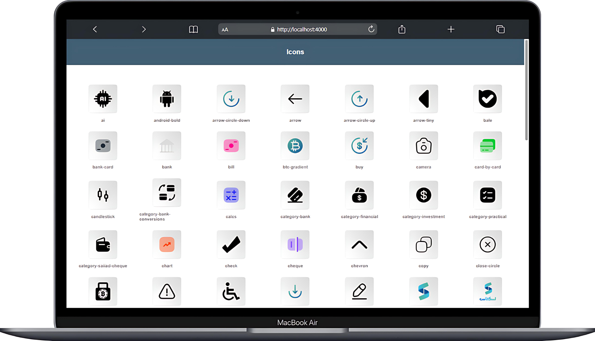

# 🧩 SVG Icon Viewer

Effortlessly preview all your SVG icons in a clean, local web interface.
<br/>
<div align="center">
    
</div>
</br>

## 🚀 Features

- 🔍 Automatically scans directories for .svg files (recursive)

- 🖼️ Displays a responsive grid of all icons in your browser

- 🌐 Runs a local preview server instantly

- ⚡ Lightweight, fast, and easy to use from the CLI

## 📦 Installation

```bash
npm install -g buildix-icon-viewer
````

## ⚙️ How to Use

Just run the CLI with the path to your SVG directory:

```bash
buildix-icon-viewer ./path/to/icons
```

or

```bash
npx buildix-icon-viewer ./path/to/icons
```

What it does:


1. Recursively scans for .svg files
2. Launches a local web server
3. Opens a preview page in your default browser

## 🌈 Example

```bash
buildix-icon-viewer ./assets/icons
```

Will show a webpage like this:

```
📁 assets/icons
├── 📁 navigation
│   ├── chevron-left.svg
│   └── chevron-right.svg
├── 📁 brands
│   ├── x-twitter.svg
│   └── github-mark.svg
└── company-logo.svg
```

And the preview page will display all 5 icons in a grid 💫

## 🤝 Contributing

Found a bug or have an idea for a new feature?
Contributions are welcome — feel free to open an issue or submit a pull request.

## 📄 License

MIT — Free to use, modify, and share.